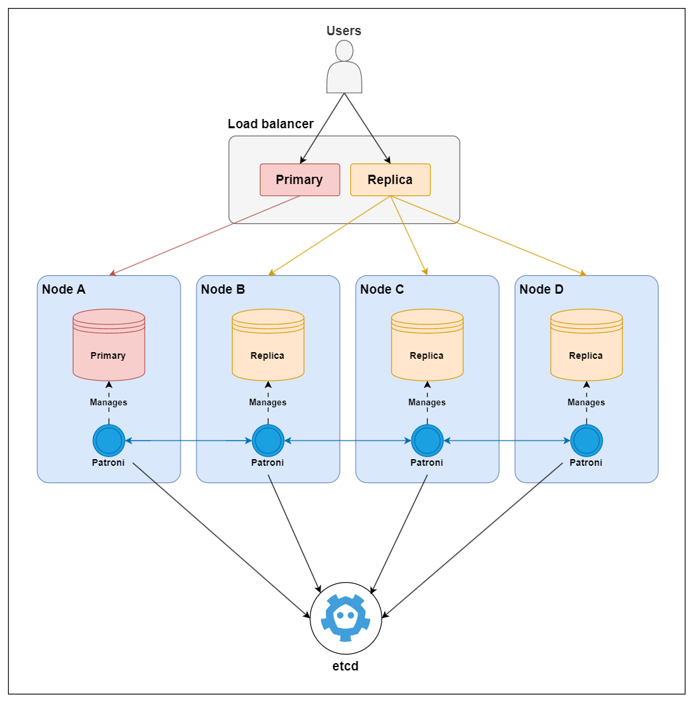
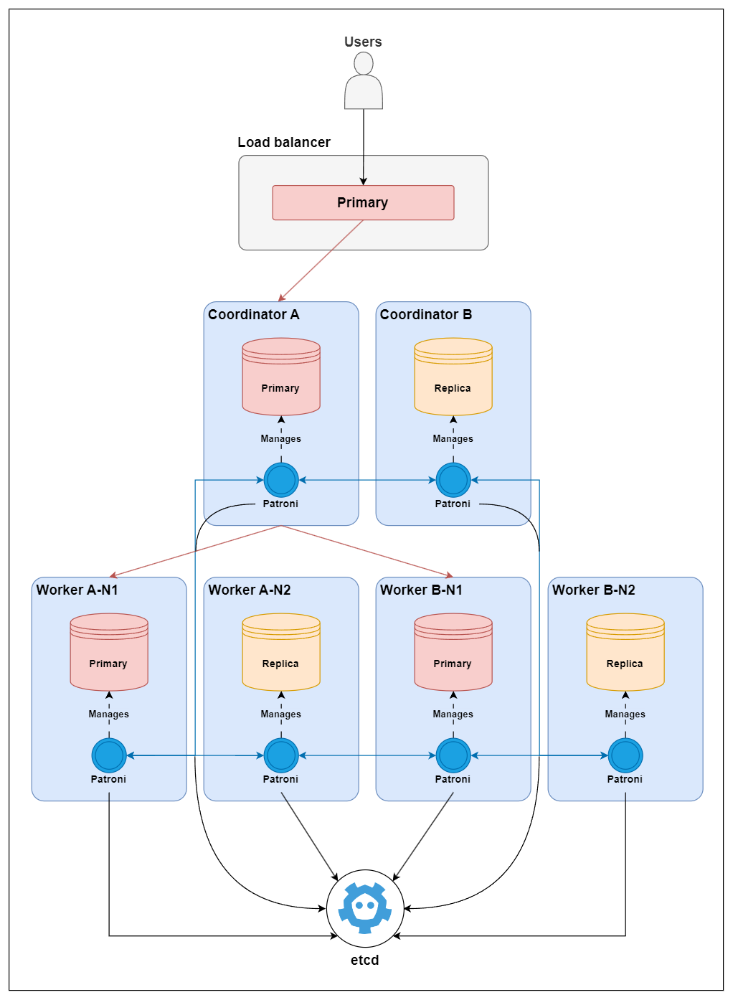

# postgres-ha-cluster

Docker Compose setup for PostgreSQL high availability cluster with custom tool for benchmarking. It provides
ready-to-use environment for testing and benchmarking various PostgreSQL high availability (HA) cluster configurations.
This setup is intended for testing purposes and is not recommended for production use. However, it can be used as a
starting point for building your own production-ready PostgreSQL HA cluster.

The repository includes multiple Docker Compose files, each tailored for a specific cluster topology. You will find
these configurations in the `postgres-ha-smr` and `postgres-ha-sharding` directories. Below are simplified diagrams
of the prepared cluster topologies.

### Single Master Replication (SMR)



### Sharding with Citus



## Benchmarking with pgload

After starting your cluster, you can use included `pgload` tool to initialize the database and run benchmarks. `pgload`
supports both replication and sharding modes and can be configured via command-line options. You can also run
ready-to-use compose file to start benchmarking desired configuration.

```bash
docker compose -f benchmark/compose.yml up -d
```

or for the sharded cluster:

```bash
docker compose -f benchmark/compose.yml -f benchmark/compose.sharding.yml up -d
```
